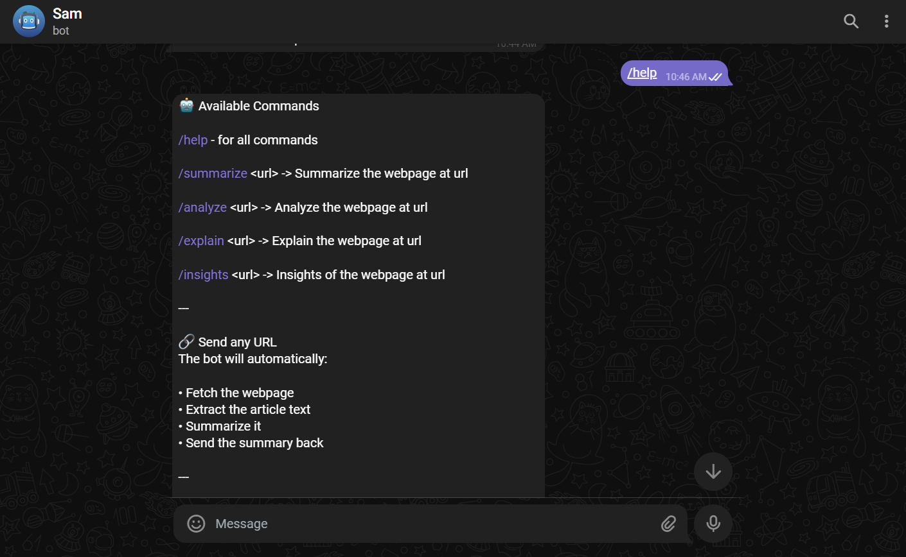
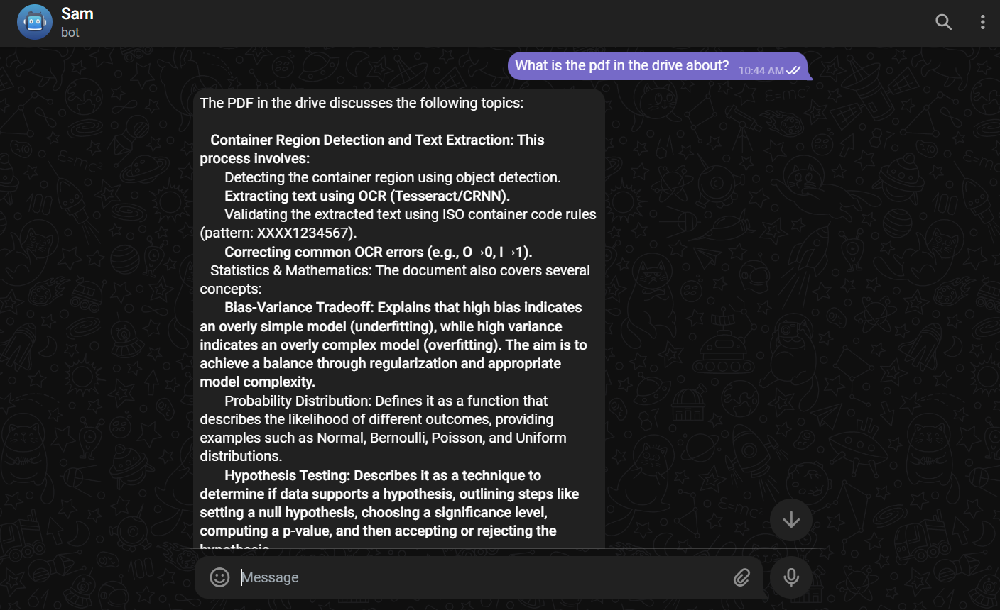

# Self-Correcting RAG Chatbot

A multi-agent Telegram chatbot with automated document ingestion, vector-based retrieval, and dual-model evaluation system that validates and self-corrects AI responses for improved accuracy.




## 🌟 Features

- **Self-Correcting Responses**: Dual-model evaluation system (Evaluator + Improver) ensures high-quality, accurate answers
- **RAG-Based Retrieval**: Queries knowledge base using vector search for hallucination-free responses
- **Automated Document Ingestion**: Continuously monitors Google Drive folder and ingests PDFs into Supabase vector database
- **Web Content Analysis**: Extracts and analyzes content from URLs with commands like `/summarize`, `/analyze`, `/explain`, `/insights`
- **Session Memory**: Maintains conversation context using buffer window memory
- **Telegram Interface**: Easy-to-use chat interface with command support

## 🏗️ Architecture

```
┌─────────────┐      ┌──────────────┐      ┌─────────────┐
│  Telegram   │─────▶│   n8n        │─────▶│  Google     │
│   User      │      │  Workflow    │      │  Gemini     │
└─────────────┘      └──────────────┘      └─────────────┘
                            │
                            ├──────────────┐
                            ▼              ▼
                     ┌─────────────┐  ┌──────────┐
                     │  Supabase   │  │  Google  │
                     │  Vector DB  │  │  Drive   │
                     └─────────────┘  └──────────┘
```

## 🛠️ Tech Stack

- **Automation**: n8n workflow automation
- **LLM**: Google Gemini 2.5 Flash
- **Vector Database**: Supabase with pgvector extension
- **Embeddings**: Google Gemini Embeddings
- **Framework**: LangChain
- **Interface**: Telegram Bot API
- **Storage**: Google Drive for document source

## 📋 Prerequisites

- n8n instance (self-hosted or cloud)
- Google Gemini API key
- Supabase account with vector extension enabled
- Telegram Bot Token
- Google Drive API credentials

### Sample Document is also included for quick setup and testing

## 🚀 Setup Instructions

### 1. Clone the Repository

```bash
git clone https://github.com/ashwathnakate/self-correcting-rag-chatbot.git
cd self-correcting-rag-chatbot
```

### 2. Configure Supabase

- Create a Supabase project
- Enable pgvector extension
- Note your project URL and anon key

### 3. Import n8n Workflow

1. Open your n8n instance
2. Go to Workflows → Import from File
3. Select `n8n-telegram-rag.json`
4. Configure credentials for each node:
   - Google Gemini API
   - Supabase (URL + anon key)
   - Telegram Bot Token
   - Google Drive API

### 4. Configure Google Drive

- Create a folder in Google Drive for your documents
- Note the folder ID from the URL
- Update the folder ID in the "Search files and folders" node

### 5. Start the Workflow

Activate the workflow in n8n. The bot will:
- Listen for Telegram messages
- Auto-ingest PDFs from Google Drive every 2 seconds
- Process user queries with RAG + self-correction

## 💬 Usage

### Basic Chat
Simply send a message to the bot - it will use RAG to answer from your knowledge base.

### Commands

- `/help` - Display all available commands
- `/summarize <url>` - Summarize content from a webpage
- `/analyze <url>` - Perform detailed analysis of webpage content
- `/explain <url>` - Break down complex concepts from a webpage
- `/insights <url>` - Extract actionable insights from a webpage

### URL Processing
Send any URL directly (without command) and the bot will automatically fetch, extract, and summarize the content.

## 📊 How It Works

### Main Pipeline

1. **User Input**: Message received via Telegram
2. **Router**: Switch node determines if it's a URL, command, or regular query
3. **RAG Agent**: For regular queries, agent uses vector search tool to retrieve relevant documents
4. **Evaluator**: Gemini model evaluates the draft answer (returns "good" or "bad")
5. **Self-Correction**: If "bad", Improver model refines the response
6. **Response**: Final answer sent back to user

### Document Ingestion Pipeline

1. **Schedule**: Triggers every 2 seconds
2. **Google Drive**: Searches for files in specified folder
3. **Download**: Fetches PDF files
4. **Text Splitting**: Recursive character splitter chunks documents
5. **Embeddings**: Google Gemini generates embeddings
6. **Storage**: Vectors stored in Supabase with metadata

## 🔧 Configuration

### Adjust Document Chunking

Modify the `Recursive Character Text Splitter` node parameters in n8n workflow

### Change Ingestion Frequency

Update the `Schedule Trigger` node interval (default: 2 seconds)

### Modify RAG Prompt

Edit the system prompt in the `AI Agent` node to customize RAG behavior

## 📁 Project Structure

```
self-correcting-rag-chatbot/
├── n8n-telegram-rag.json              # Main n8n workflow
├── assets/
│   └── img1.png                       # Demo GIF
        img2.png                       
├── .gitignore
├── LICENSE
└── README.md
```

## 🎯 Key Features Explained

### Self-Correction Mechanism
The dual-model approach ensures quality:
- **Evaluator**: Quickly judges if response is "good" or "bad"
- **Improver**: Refines "bad" responses for clarity and accuracy
- Only improved responses are sent to users

### Strict RAG Implementation
The agent is constrained to:
- Only use retrieved context from vector database
- Never hallucinate or use general knowledge
- Explicitly state when information isn't available

### Session Management
Each Telegram chat maintains its own conversation history using buffer window memory.

## 🐛 Troubleshooting

**Bot Not Responding**
- Check if n8n workflow is active
- Verify Telegram webhook is configured
- Check n8n execution logs

**RAG Returns Empty Results**
- Ensure documents are ingested in Supabase
- Verify embedding model consistency
- Check vector table has data

**Google Drive Ingestion Issues**
- Confirm folder ID is correct
- Check Google Drive API permissions using OAuth2
- Verify credentials in n8n

## 🤝 Contributing

Contributions are welcome! Please feel free to submit a Pull Request.

## 📝 License

This project is licensed under the MIT License - see the [LICENSE](LICENSE) file for details.

## 🙏 Acknowledgments

- [n8n](https://n8n.io/) - Workflow automation platform
- [LangChain](https://langchain.com/) - LLM framework
- [Supabase](https://supabase.com/) - Vector database
- [Google Gemini](https://deepmind.google/technologies/gemini/) - LLM and embeddings

Project Link: [https://github.com/yourusername/self-correcting-rag-chatbot](https://github.com/yourusername/self-correcting-rag-chatbot)

---

⭐ If you found this project helpful, please consider giving it a star!